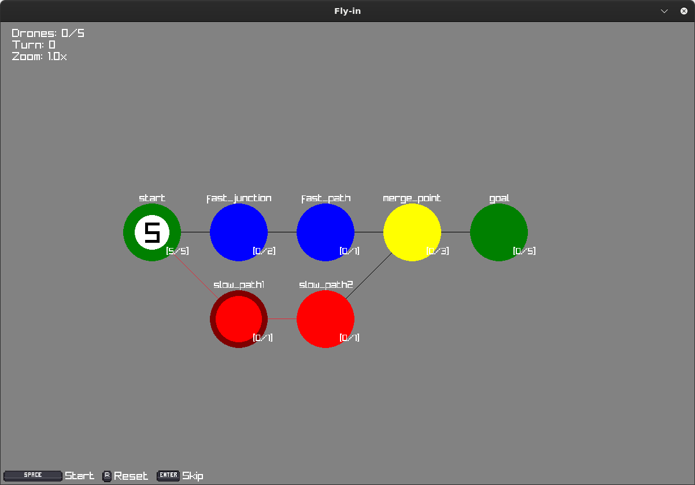
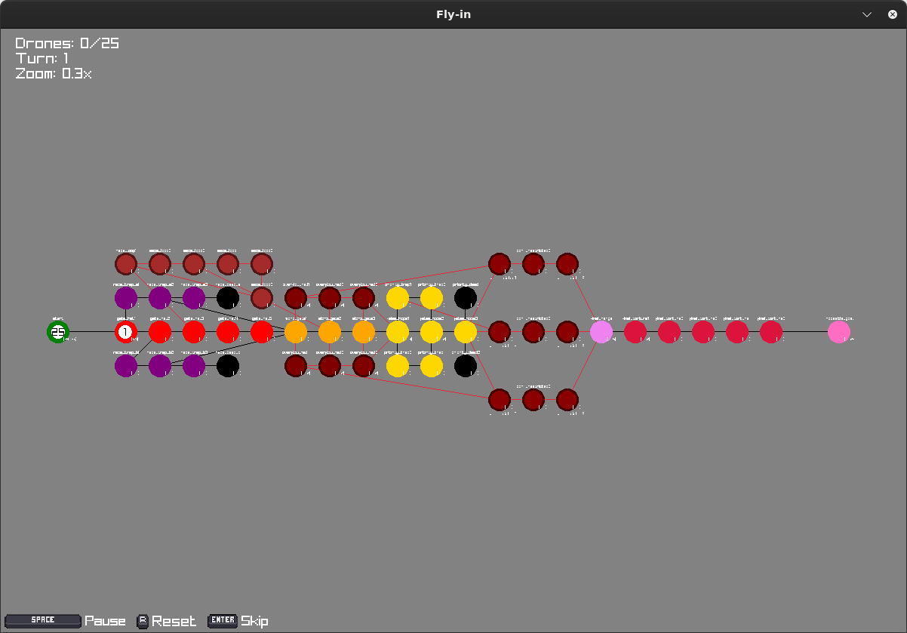
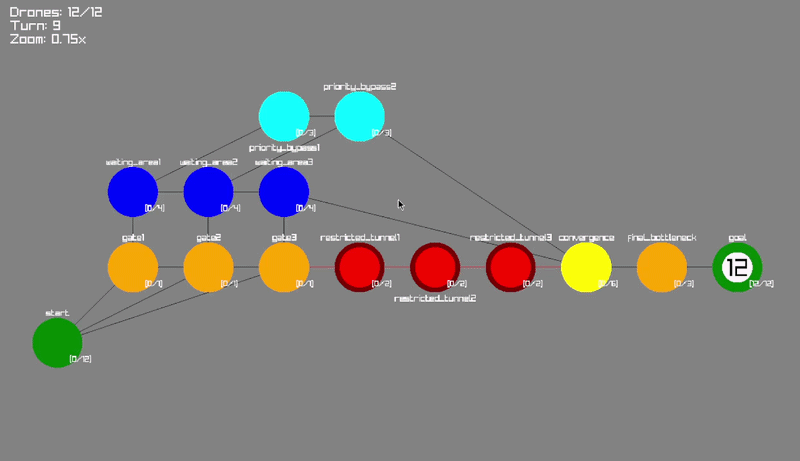
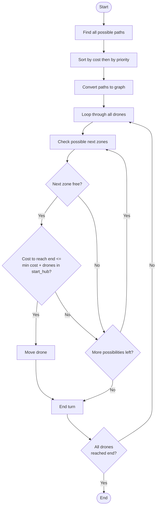

This project has been created as part of the 42 curriculum by `smahraz`

## Description:
The objectives of this project are multiple, but the main focus is on path finding and synchronizing drones to achieve the most efficient movement, minimizing the number of turns as much as possible.
This algorithm was created entirely by me. It works by dynamically choosing the next zone based on the available paths and traffic congestion. I also used a generator so that I wouldn’t have to load everything into memory.

## Visualization:
- i used [raylib](https://www.raylib.com) for visualization.
- The visual representation provides an intuitive view of the environment, including zones, connections, and drone movements. It helps users better understand the pathfinding process, monitor drone synchronization, and analyze the efficiency of the generated routes.





map: `maps/hard/02_capacity_hell.txt`
## Instructions:
- to run:
```bash
make
```
or
```bash
make run
```
- for special map:
```bash
uv run python -m flyin <map_path>
```
##### Install dependencies:
```bash
uv sync
```
## Resources:
- [Dijkstra](https://en.wikipedia.org/wiki/Dijkstra's_algorithm)
- [dfs](https://www.youtube.com/watch?v=Urx87-NMm6c)
##### Use of AI:
- doc string

## Approach:
Working with multiple paths was simple. The question is whether it is worth taking the longest path and leaving room for the other drones.

The idea is to compare the cost of the available path with the cost of the shortest path plus the number of drones that would take it:

$$
C_{\text{shortest}} + \max(1, D_{\text{start}} - 1) \geq C_{\text{available}}
$$

If this condition is satisfied, taking the available path is worthwhile. The drone taking the longest path should arrive at roughly the same time as the last drone taking the shortest path:

$$
C_{\text{longest}} \approx C_{\text{shortest}} + (D_{\text{start}} - 1)
$$

where C is the path cost and Dstart is the number of drones at the starting hub.



###### Graph:
- zone gives `dict` of possible next zones with cost.
- next possible zones are sorted by default (cost first, then priority).
```python
{
    Zone(start: 0.0,0.0): {
	    Zone(fast_junction: 150.0,0.0): 4,
	    Zone(slow_path1: 150.0,150.0): 5
	},
    Zone(fast_junction: 150.0,0.0): {
	    Zone(fast_path: 300.0,0.0): 3
	},
    Zone(fast_path: 300.0,0.0): {
	    Zone(merge_point: 450.0,0.0): 2
	},
    Zone(merge_point: 450.0,0.0): {
	    Zone(goal: 600.0,0.0): 1
	},
    Zone(slow_path1: 150.0,150.0): {
	    Zone(slow_path2: 300.0,150.0): 3
	},
    Zone(slow_path2: 300.0,150.0): {
	    Zone(merge_point: 450.0,0.0): 2
	}
}
```
